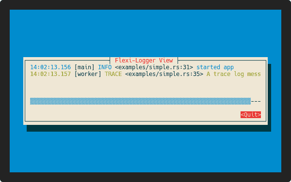

# cursive-logger-view

A fork of [cursive-flexi-logger-view](https://github.com/deinstapel/cursive-flexi-logger-view).

---

This project provides a new debug view for [gyscos/cursive](https://github.com/gyscos/cursive) using the [emabee/flexi_logger](https://github.com/emabee/flexi_logger) crate. This enables the `FlexiLoggerView` to respect the `RUST_LOG` environment variable as well as the `flexi_logger` configuration file. Have a look at the `demo` below to see how it looks.

## How does it look like?

<details>
  <summary>Expand to view</summary>
  
</details>

## Usage

Simply add dependencies

```add
cargo add log flexi_logger cursive cursive_logger_view
```

### Using the `FlexiLoggerView`

```rust
use cursive::{
    view::Scrollable,
    views::{Dialog, Panel},
};
use cursive_logger_view::{cursive_flexi_logger, FlexiLoggerView};
use flexi_logger::Logger;

fn main() {
    // we need to initialize cursive first, as the cursive-flexi-logger
    // needs a cursive callback sink to notify cursive about screen refreshs
    // when a new log message arrives
    let mut siv = cursive::default();

    Logger::try_with_env_or_str("debug")
        .expect("Could not create Logger from environment :(")
        .log_to_file_and_writer(
            flexi_logger::FileSpec::default()
                .directory("logs")
                .suppress_timestamp(),
            cursive_flexi_logger(&siv),
        )
        .duplicate_to_stderr(flexi_logger::Duplicate::Warn)
        .append()
        .format(flexi_logger::colored_with_thread)
        .format_for_files(flexi_logger::detailed_format)
        .format_for_stderr(flexi_logger::colored_default_format)
        .print_message()
        .start()
        .expect("failed to initialize logger!");

    siv.add_layer(Panel::new(FlexiLoggerView::scrollable()));
    // omit `scrollable` to remove scrollbars
    // siv.add_layer(DebugView::new());

    siv.add_layer(Dialog::text("hello world").scrollable());
    log::info!("info, test log message");
    log::error!("dbg, hello world");
    log::warn!("warn, hello world");

    siv.run();
}
```

Look into the [documentation](https://docs.rs/cursive-logger-view) for a detailed explanation on the API.
