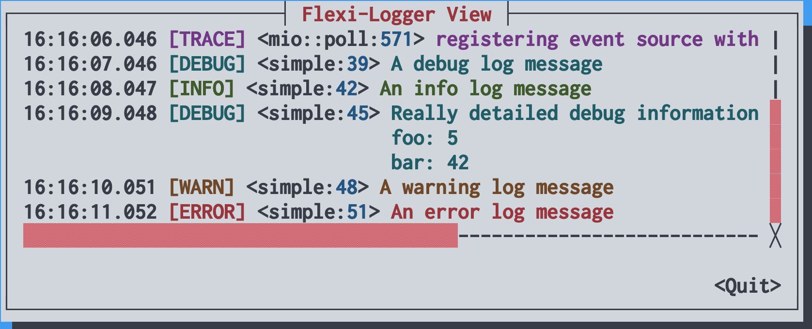

# cursive-logger-view

[](https://crates.io/crates/cursive-logger-view)
[](https://docs.rs/cursive-logger-view)

A fork of [cursive-flexi-logger-view](https://github.com/deinstapel/cursive-flexi-logger-view).

---

This project provides a new debug view for [gyscos/cursive](https://github.com/gyscos/cursive) using the [emabee/flexi_logger](https://github.com/emabee/flexi_logger) crate. This enables the `FlexiLoggerView` to respect the `RUST_LOG` environment variable as well as the `flexi_logger` configuration file.



## Usage

### Simply add dependencies

```add
cargo add log flexi_logger cursive cursive_logger_view
```

### Using the `FlexiLoggerView`

```rust
use cursive_logger_view::{CursiveLogWriter, FlexiLoggerView};
use flexi_logger::Logger;

fn main() {
    // Initialize the Cursive TUI (Terminal User Interface) instance
    let mut siv = cursive::default();

    // Configure the flexi logger with environment-variable($RUST_LOG) or fallback to "trace" level
    Logger::try_with_env_or_str("trace")
        .expect("Could not create Logger from environment :(")
        // Configure logging to both file and Cursive
        .log_to_file_and_writer(
            // File configuration: store logs in 'logs' directory without timestamps
            flexi_logger::FileSpec::default()
                .directory("logs")
                .suppress_timestamp(),
            // Create Cursive log writer and box it for dynamic dispatch
            CursiveLogWriter::new(&siv)
                //// Optional format configuration (commented out example)
                // .with_format({
                //     use cursive_logger_view::LogItems::*;
                //     [Level, DateTime, ModLine, Message]
                //         .into_iter()
                //         .collect()
                // })
                // .with_time_format("%T%.6f".into())
                .into_boxed(),
        )
        .start()
        .expect("failed to initialize logger!");

    // Add the logger view to Cursive
    siv.add_layer(
        FlexiLoggerView::new()
            // .with_indent(true)  // Optional indentation configuration
            //
            .wrap_scroll_view(),
    );

    log::debug!("x: 42");
    log::info!("Foo\nBar"); // Info level with multi-line content
    log::error!("Failed to open file");

    siv.run()
}
```

Look into the [documentation](https://docs.rs/cursive-logger-view) for a detailed explanation on the API.
